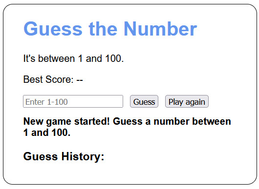
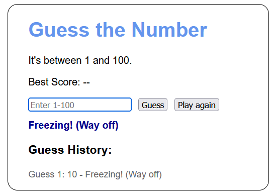
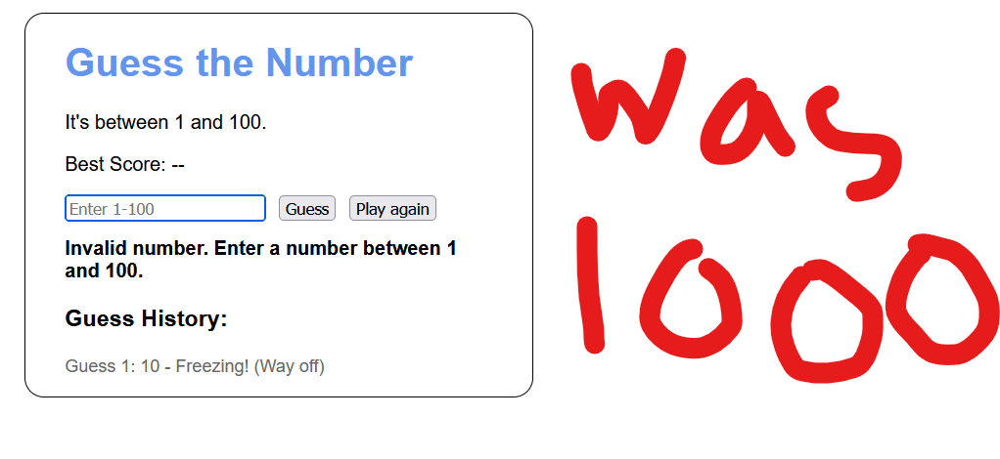
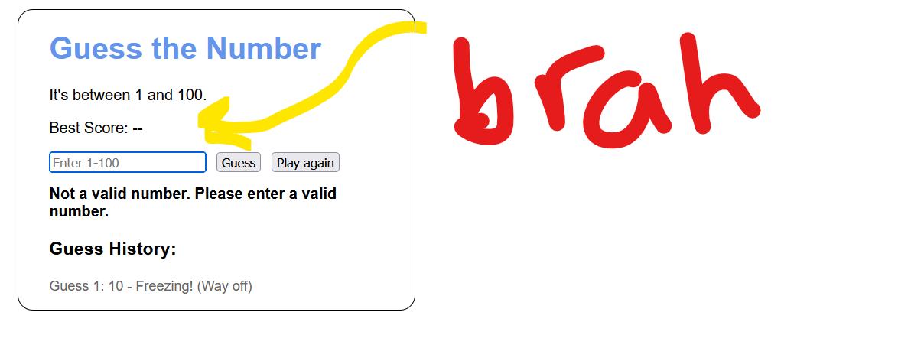
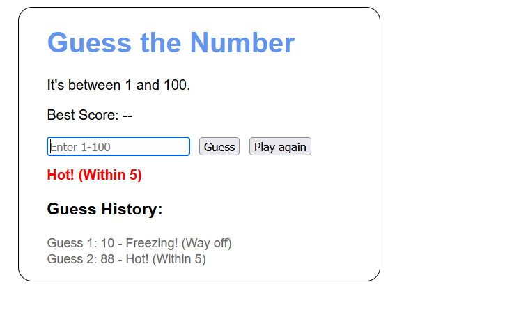
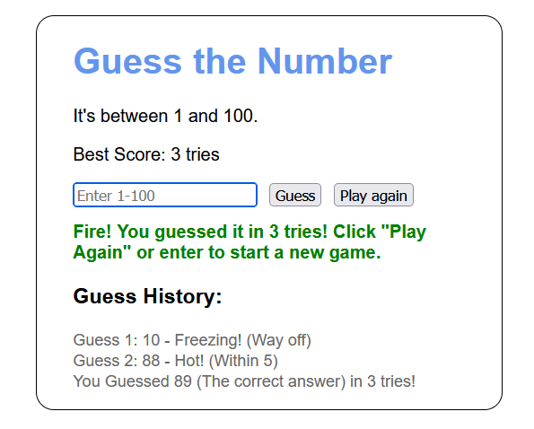
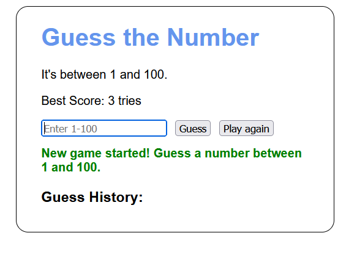
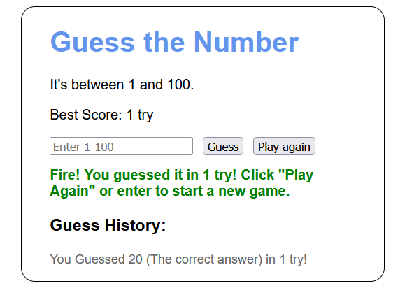

# Chapter 5 Project
- **GitHub:** [Project](https://github.com/isguil02/Chap5)
## AI Usage
-  Used AI to switch the if else statments to a switch since I completly  coded it with a if else 
## Overview
An number guessing game where the user attempts to guess a 
 * randomly generated number between 1 and 100 the game provides feedback 
 * based on how close the guess is to the target number (Hot/Cold/Freezing).
 * The application tracks the number of tries, prevents duplicate guesses,
 * and maintains a best score record.

## Console Output

## New Concepts Used
- How to change the color of text in JS
- Understand better how to change text that show up on page
- Learn How Random Number Generation works in JS

## Author
- **GitHub:** [My GitHub Profile](https://github.com/isguil02)
